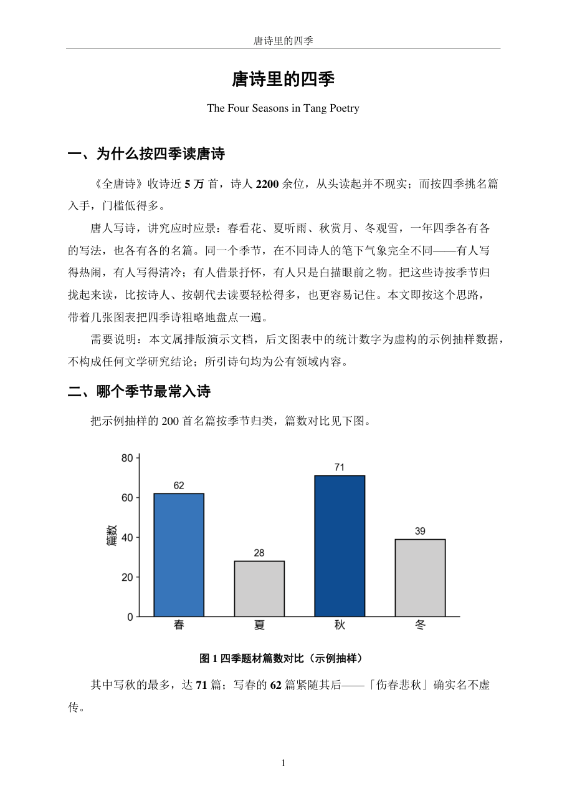
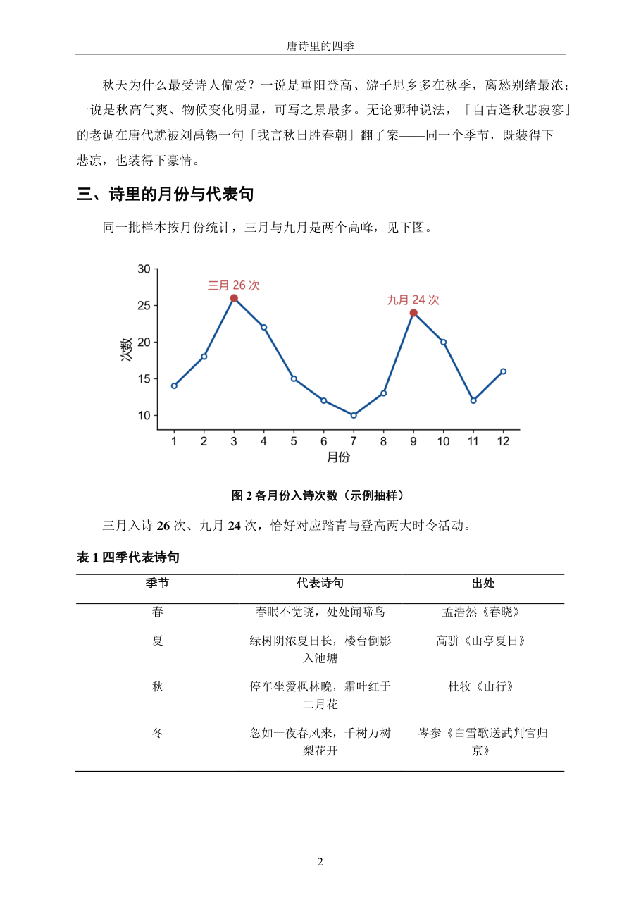
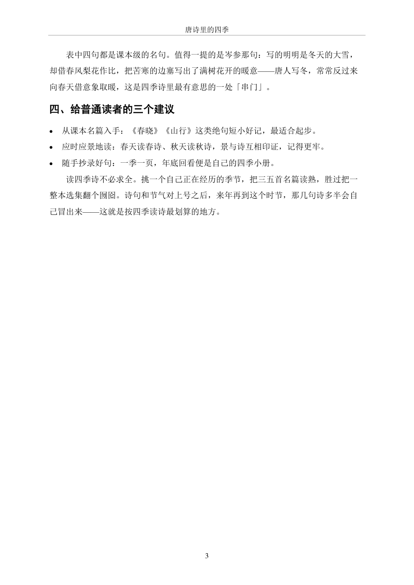

# clean-docx

> Give AI-generated Chinese / mixed Chinese-English Word documents (.docx) one consistent
> academic layout automatically — SimSun for Chinese, Times New Roman for Latin text and
> digits, SimHei headings, booktabs-style tables, page numbers. Compliant on generation,
> no manual fixing afterwards.

📖 中文版: [README.md](./README.md)

Quick install (Claude Code; other platforms: see [Install](#install)):

```bash
git clone https://github.com/SEAMAN9000/clean-docx.git && mkdir -p ~/.claude/skills && cp -r clean-docx/skill/clean-docx ~/.claude/skills/
```

## When to use

Word documents generated directly by AI tend to have chaotic typography: Latin text and
digits wrapped in Chinese fonts, code fonts leaking into body text, several typefaces
fighting in one document — every generation needs manual rework. This skill turns a fixed
layout spec into a function library plus checkers: the spec is applied at generation time
and the document is health-checked before saving.

✅ Good for:

- Having AI write Chinese reports, papers, reviews, proposals, teaching material, memos — straight to .docx
- Converting Markdown / loose drafts into consistently formatted Word documents
- Scoring a messy existing .docx to find problems, or force-fixing its fonts in one call
- Reusing a ready-made layout library in your own python-docx scripts

❌ Not for:

- English-only papers — use your target journal's template
- PDF / Excel / PowerPoint — out of scope; use the dedicated tools for each
- Custom themes or brand styling — this skill deliberately pins one spec (see "Design trade-offs")

## What it looks like

Reading convention: lines starting with `>` are what you type; the rest is screen output.

```text
> Turn this "Four Seasons in Tang Poetry" draft into a Word document

(Claude picks up clean-docx automatically, generates the document with its
 function library, and health-checks it before saving)

Generated 唐诗里的四季.docx (3 pages):
  structural review: 0 warnings
  format lint: 10/10 compliant (1 item skipped)
```

You can also score any existing .docx from the command line (real output below;
the checker prints in Chinese):

```text
$ python skill/clean-docx/scripts/lint_docx.py 唐诗里的四季_案例.docx
=== 唐诗里的四季_案例.docx ===
  文档类型： 中文/中英混排
  ✓ [ 1] 正文字号 12pt
  ✓ [ 2] 行距 1.5 倍
  ✓ [ 3] 标题中文字体 黑体
  ✓ [ 4] 一级标题字号 15pt
  ✓ [ 5] 表格三线表
  ✓ [ 6] 页脚页码
  ✓ [ 7] 页面 A4 + 2.5cm 边距
  ✓ [ 8] 正文首行缩进 2 字符
  ✓ [ 9] 一级标题段前后距
  – [10] 篇幅对应的页眉/目录  （约 1 页）
  ✓ [11] 中文 run 均设字体(不回退)
  ── 得分 10/10（另跳过 1 项）→ 合规
```

Your part: say what you want, once. Document content and check details vary per draft;
what never changes is the pipeline (generate → structural review → format lint → save)
and the layout rules themselves.

Layout samples (a 3-page demo document; content is for layout demonstration only,
figures are fictional):

| Page 1 | Page 2 | Page 3 |
|---|---|---|
|  |  |  |

## Runtime support

### ✅ Claude Code

- Install path: `~/.claude/skills/clean-docx/`
- Project memory file: `CLAUDE.md`
- Triggering: semantic auto-trigger (see "Triggering"), no slash command

### ✅ Codex CLI

- The skill is a standard `SKILL.md` + scripts package with no Claude-only features; works as-is
- Copy into `skills/clean-docx/` inside your project (keep the filename `SKILL.md`); project memory file is `AGENTS.md`

### ✅ OpenCode

- OpenCode reads the `~/.claude/skills/` path, so the Claude Code install works unchanged
- Project memory file is `AGENTS.md`

## Install

Common dependency (all platforms):

```bash
pip install python-docx
```

### Let your AI install it (tool-agnostic)

Copy this whole block to your AI tool:

```text
Install this skill for me: https://github.com/SEAMAN9000/clean-docx
First identify which tool you are running in (Claude Code / Codex CLI / OpenCode),
then read the "Install" section of the repo README and follow the steps
for that platform.
```

### Claude Code

```bash
git clone https://github.com/SEAMAN9000/clean-docx.git
mkdir -p ~/.claude/skills
cp -r clean-docx/skill/clean-docx ~/.claude/skills/
```

Windows (PowerShell):

```powershell
git clone https://github.com/SEAMAN9000/clean-docx.git
New-Item -ItemType Directory -Force "$env:USERPROFILE/.claude/skills"
Copy-Item -Recurse clean-docx/skill/clean-docx "$env:USERPROFILE/.claude/skills/"
```

Verify: start a new session and say "use clean-docx to generate a one-page test document" —
if you get a .docx plus a lint score, it's installed.

### Codex CLI

```bash
git clone https://github.com/SEAMAN9000/clean-docx.git
mkdir -p ./skills
cp -r clean-docx/skill/clean-docx ./skills/
```

Verify: same test sentence as above. If the skill does not trigger, the two scripts under
`scripts/` work standalone (see "Using it as a plain library").

### OpenCode

Identical to Claude Code — OpenCode reads the `~/.claude/skills/` path.

## Triggering

No slash command; it triggers semantically. Requests carrying any of the following
(mirroring the `description` in `SKILL.md`) will trigger it:

| Your request contains | 中文原短语 |
|---|---|
| write a Chinese report / paper / review / proposal / teaching material / memo as Word | 写报告 / 论文 / 综述 / 方案 / 教材 / 备忘 等中文 Word 文档 |
| typesetting / fonts / consistent formatting | 排版 / 字体 / 格式统一 |
| generate a .docx / Word document | 生成 docx / Word 文档 |
| save / export the content as Word | 把内容另存为 / 导出为 Word 或 docx |
| convert Markdown to Word | md / Markdown 转 Word / 转 docx |
| build a Word document with python-docx | 用 python-docx 生成 / 拼一个 Word 文档 |

Will NOT trigger: English-only papers, PDF, Excel, PowerPoint, or generic typography chat
that doesn't end in a .docx. To force it: say "use the clean-docx skill to …".

## After it runs

Pipeline (fully automatic, no confirmation needed):

1. Once triggered, the AI imports the `scripts/docx_style.py` library to build the document
   instead of hand-writing python-docx details;
2. Before saving it runs two complementary checks: `review` for structure (heading levels,
   numbering continuity, figure/table cross-references, formulas) and `lint` for format
   (11 hard rules);
3. Failing checks never block — the document is saved anyway and you are told which rules
   failed; fixing is your call.

Output: exactly the one `output.docx` you asked for (plus a PDF if you requested one).

Write boundary: only the output file you named is written; nothing else in your project is
touched, and the skill's own directory is never modified.

Failure semantics: if generation errors out mid-way there is no output (at most a half
file you can simply delete) — just ask again; a failed lint rule is not a failure, see above.

Note: page numbers and the table of contents are Word "fields" (press F9 or right-click →
Update Field after opening); when converting to PDF by script, update fields in Word first.

## Using it as a plain library

Works in your own Python scripts without any AI:

```python
import sys; sys.path.insert(0, "skill/clean-docx/scripts")
import docx_style as ds

doc = ds.new_document()                  # A4 + 2.5cm margins
ds.add_page_number(doc)
ds.add_title(doc, "报告标题", "English Subtitle")
ds.add_heading(doc, "一、研究背景", 1)
ds.add_body(doc, [("key figure ", False), ("2.9%", True), (" gets bold.", False)])
ds.add_table_title(doc, "表1 示例")
ds.add_three_line_table(doc, [["指标", "2023", "2024"], ["A", "1", "2"]])
print(ds.review(doc))                    # structural review: list of warnings
print(ds.lint(doc)["score"])             # format lint: score
doc.save("output.docx")
```

After editing an existing document, or writing runs by hand elsewhere, call
`ds.enforce_fonts(doc)` once before saving to force-normalize every run's fonts
(the cure for Chinese text falling back to default fonts). All functions are documented
in the library's header comments; the layout spec lives in
[skill/clean-docx/references/spec.md](skill/clean-docx/references/spec.md) (in Chinese).

## Repository layout

- `skill/clean-docx/` — the skill package itself (this is what you copy to install)
- `demo/` — layout sample images

## Design trade-offs

- **One pinned spec, not a configurable theme.** You get zero decisions and identical output
  every time; the cost is that changing tastes means editing the constants at the top of
  `scripts/docx_style.py` (fonts and sizes are all there).
- **The library guarantees correctness up front; `enforce_fonts` is only a safety net.**
  Layout is decided at generation time, not patched afterwards; the cost is that bypassing
  the library can still produce a mess — hence the safety net and the checkers.
- **Failed lint never blocks.** You always get your document; the cost is that a
  non-compliant document can be saved — fixing is your decision.
- **Page numbers and TOC are Word fields, not hard-coded.** They stay correct through any
  edit; the cost is one F9 press after opening.
- **Known limits:** Chinese / mixed Chinese-English documents only (English-only papers
  should use journal templates); the header/TOC size thresholds rest on a page-count
  estimate that can misjudge borderline documents — just say explicitly whether you
  want them.

## License

MIT — see [LICENSE](./LICENSE)
